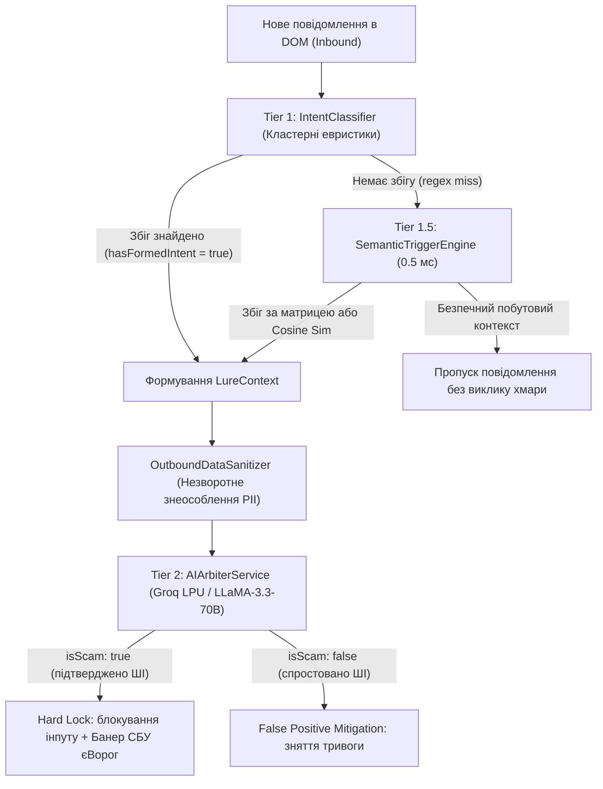
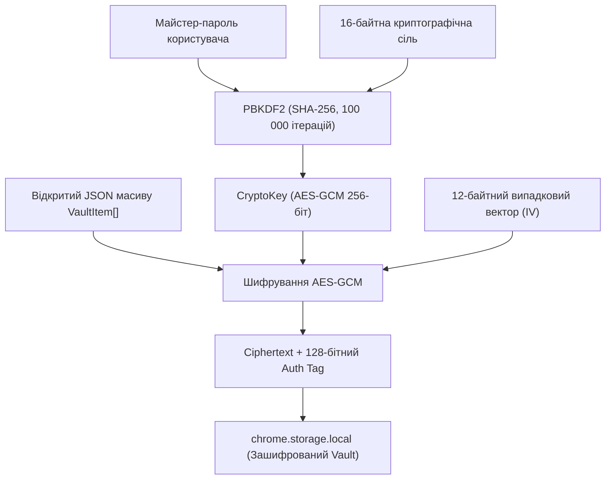
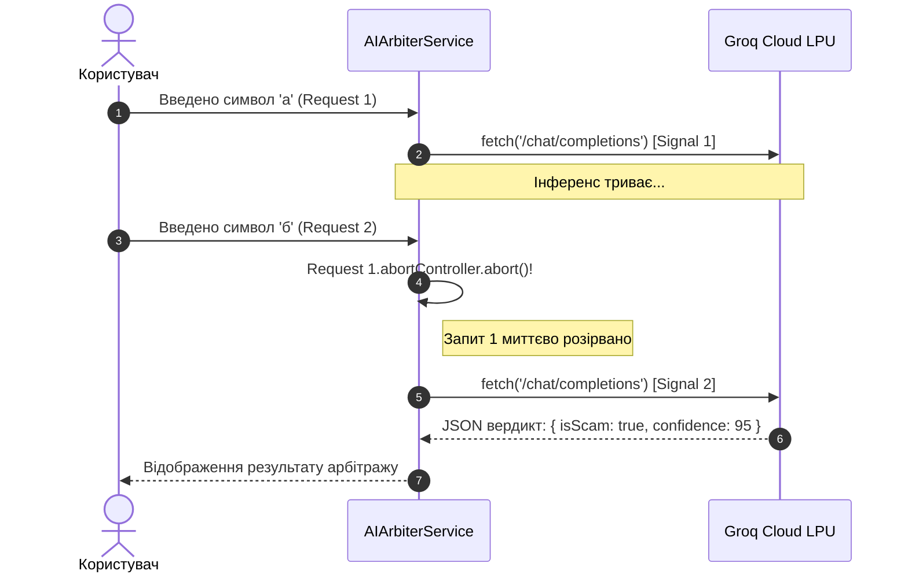

# СИСТЕМА ОПЕРАТИВНОГО ВИЯВЛЕННЯ АНОМАЛІЙ «С.О.В.А.» (ADAPTIVE THREAT SHIELD)
## ПОВНА ТЕХНІЧНА СПЕЦИФІКАЦІЯ ТА АРХІТЕКТУРНИЙ АНАЛІЗ РЕАЛІЗАЦІЇ

> **Статус документа:** Еталонна технічна специфікація та архітектурний опис  
> **Версія системи:** 1.0.0 (Production Release / Дипломна робота)  
> **Цільова платформа:** Chromium Browser Environment (Manifest V3)  
> **Формат шляхів:** Відносні шляхи репозиторію (Relative Paths Only)  
> **Актуальний стан перевірки (09.10.2026):** повний прогін без Groq після останніх локальних правок — 554/555 тестів; єдиний провал — агрегована перевірка точного збігу корпусу (67 розбіжностей). Цільові unit-тести класифікатора проходять 48/48, TypeScript-компіляція проходить. Корпус має 259/326 точних результатів (F1 84,8%); деталі й попередній baseline наведено в розділі 11.1 та `tests/evaluation/RESULTS.md`.

---

## ЗМІСТ

- [1. ВСТУП ТА МІСІЯ ПРОЄКТУ](#1-вступ-та-місія-проєкту)
  - [1.1. Контекст дипломної роботи та призначення](#11-контекст-дипломної-роботи-та-призначення)
  - [1.2. Профіль загроз воєнного та мирного часу](#12-профіль-загроз-воєнного-та-мирного-часу)
  - [1.3. Порівняльна характеристика з існуючими рішеннями](#13-порівняльна-характеристика-з-існуючими-рішеннями)
  - [1.4. Термінологічний глосарій](#14-термінологічний-глосарій)
- [2. АРХІТЕКТУРА СИСТЕМИ ТА СТЕК MANIFEST V3](#2-архітектура-системи-та-стек-manifest-v3)
  - [2.1. Точки входу (Entrypoints) та ізоляція середовищ](#21-точки-входу-entrypoints-та-ізоляція-середовищ)
  - [2.2. Модульна структура файлової системи](#22-модульна-структура-файлової-системи)
  - [2.3. Міжпроцесна шина взаємодії (IPC Message Bus)](#23-міжпроцесна-шина-взаємодії-ipc-message-bus)
- [3. МЕХАНІЗМ ЗШИВАННЯ СЕСІЙ ТА КРОС-ВКЛАДОЧНОГО КОНТЕКСТУ](#3-механізм-зшивання-сесій-та-крос-вкладочного-контексту)
  - [3.1. Архітектура Tainted Context Window](#31-архітектура-tainted-context-window)
  - [3.2. Алгоритм наслідування родоводу вкладок (Tab Lineage Propagation)](#32-алгоритм-наслідування-родоводу-вкладок-tab-lineage-propagation)
  - [3.3. Вплив успадкованого контексту на скоринг форм](#33-вплив-успадкованого-контексту-на-скоринг-форм)
  - [3.4. Каскадне очищення зараженого контексту (Cluster Invalidation)](#34-каскадне-очищення-зараженого-контексту-cluster-invalidation)
  - [3.5. Ізоляція сесій та детекція навігації в односторінкових додатках (SPA Navigation & Cross-Chat Isolation)](#35-ізоляція-сесій-та-детекція-навігації-в-односторінкових-додатках-spa-navigation--cross-chat-isolation)
- [4. СЕМАНТИЧНИЙ АНАЛІЗ ТА ВИЗНАЧЕННЯ НАМІРУ (INTENT CLASSIFIER)](#4-семантичний-аналіз-та-визначення-наміру-intent-classifier)
  - [4.1. Кластерна архітектура розпізнавання намірів](#41-кластерна-архітектура-розпізнавання-намірів)
  - [4.2. Специфікація 8 категорій кіберзагроз](#42-специфікація-8-категорій-кіберзагроз)
  - [4.3. Алгоритм конфірмації наміру (evaluateStatefulIntent)](#43-алгоритм-конфірмації-наміру-evaluatestatefulintent)
  - [4.4. Динамічне розширення кластерів через Personal Vault](#44-динамічне-розширення-кластерів-через-personal-vault)
  - [4.5. Семантичний векторний рушій та прагматична матриця намірів (Tier 1.5 SemanticTriggerEngine)](#45-семантичний-векторний-рушій-та-прагматична-матриця-намірів-tier-15-semantictriggerengine)
- [5. ЛІНГВІСТИЧНА ОБРОБКА, НОРМАЛІЗАЦІЯ ТА ПОШУК СЛІВ (FUZZY MATCHER)](#5-лінгвістична-обробка-нормалізація-та-пошук-слів-fuzzy-matcher)
  - [5.1. Подолання обмежень граничних регулярів `\b` у кирилиці](#51-подолання-обмежень-граничних-регулярів-b-у-кирилиці)
  - [5.2. Канонічне згортання гомогліфів (Homoglyph Canonical Folding)](#52-канонічне-згортання-гомогліфів-homoglyph-canonical-folding)
  - [5.3. Багатопотоковий токенізатор (Dual-Stream Tokenizer)](#53-багатопотоковий-токенізатор-dual-stream-tokenizer)
  - [5.4. Метод ковзних n-грам (Sliding N-grams) для багатослівних секретів](#54-метод-ковзних-n-грам-sliding-n-grams-для-багатослівних-секретів)
  - [5.5. Двостороння транслітерація та метрика Левенштейна](#55-двостороння-транслітерація-та-метрика-левенштейна)
- [6. КРИПТОГРАФІЯ ТА ZERO-KNOWLEDGE DLP СХОВИЩЕ (PERSONAL VAULT)](#6-криптографія-та-zero-knowledge-dlp-сховище-personal-vault)
  - [6.1. Криптографічний шар WebCrypto API (PBKDF2 та AES-GCM)](#61-криптографічний-шар-webcrypto-api-pbkdf2-та-aes-gcm)
  - [6.2. Життєвий цикл сесійних ключів та експорт у JWK](#62-життєвий-цикл-сесійних-ключів-та-експорт-у-jwk)
  - [6.3. Модель нульового розголошення (Salted HMAC-SHA256 Blind Tokens)](#63-модель-нульового-розголошення-salted-hmac-sha256-blind-tokens)
  - [6.4. Перевірка введення у заблокованому стані за O(1)](#64-перевірка-введення-у-заблокованому-стані-за-o1)
  - [6.5. Категоризація та автоматична генерація Decoy-значень](#65-категоризація-та-автоматична-генерація-decoy-значень)
- [7. ЗНЕОСОБЛЕННЯ КОНТЕКСТУ (OUTBOUND DATA SANITIZER)](#7-знеособлення-контексту-outbound-data-sanitizer)
  - [7.1. Принципи приватності Zero-Knowledge Outbound Protection](#71-принципи-приватності-zero-knowledge-outbound-protection)
  - [7.2. Регулярні алгоритми детекції та токенізації активів](#72-регулярні-алгоритми-детекції-та-токенізації-активів)
  - [7.3. Псевдонімізація учасників діалогу](#73-псевдонімізація-учасників-діалогу)
  - [7.4. Генерація безпечного інженерного промпта та телеметрія](#74-генерація-безпечного-інженерного-промпта-та-телеметрія)
- [8. ШІ-АРБІТРАЖ ТА ПЕРЕДАЧА У GROQ (TIER 2 LLM)](#8-ші-арбітраж-та-передача-у-groq-tier-2-llm)
  - [8.1. Архітектура черги Single-Flight Queue та AbortController](#81-архітектура-черги-single-flight-queue-та-abortcontroller)
  - [8.2. Дворівневе кешування та сесійний імунітет](#82-дворівневе-кешування-та-сесійний-імунітет)
  - [8.3. Детальна реалізація драйвера GroqDriver](#83-детальна-реалізація-драйвера-groqdriver)
  - [8.4. Системний промпт та суворий JSON-контракт](#84-системний-промпт-та-суворий-json-контракт)
  - [8.5. Парсинг та відмовостійкий фолбек (Resilience Engineering)](#85-парсинг-та-відмовостійкий-фолбек-resilience-engineering)
  - [8.6. Безпечне сховище API-ключів (SecureKeyStore)](#86-безпечне-сховище-api-ключів-securekeystore)
- [9. ДЕТЕКЦІЯ ФОРМ, ПЕРЕХОПЛЕННЯ ТА ПРОАКТИВНИЙ ЗАХИСТ](#9-детекція-форм-перехоплення-та-проактивний-захист)
  - [9.1. Модульний конвеєр FormAnalysisPipeline (5 детекторів)](#91-модульний-конвеєр-formanalysispipeline-5-детекторів)
  - [9.2. Детекція пасток прихованого автозаповнення (Autofill Phishing)](#92-детекція-пасток-прихованого-автозаповнення-autofill-phishing)
  - [9.3. Запечатування полів Sanctuary Sealed Apertures](#93-запечатування-полів-sanctuary-sealed-apertures)
  - [9.4. Глобальні інтерцептори подій (Form, Chat, Clipboard)](#94-глобальні-інтерцептори-подій-form-chat-clipboard)
- [10. ПОЯСНЮВАЛЬНИЙ ШІ (XAI) ТА ІЗОЛЯЦІЯ SHADOW DOM](#10-пояснювальний-ші-xai-та-ізоляція-shadow-dom)
  - [10.1. Формула контрасту (User Intent vs Threat Reality)](#101-формула-контрасту-user-intent-vs-threat-reality)
  - [10.2. Реконструкція ланцюга атаки (Attack Chain Steps)](#102-реконструкція-ланцюга-атаки-attack-chain-steps)
  - [10.3. Ізоляція ShadowHost та система дизайн-токенів](#103-ізоляція-shadowhost-та-система-дизайн-токенів)
  - [10.4. Інтерфейси UnifiedModal та DebuggerOverlay](#104-інтерфейси-unifiedmodal-та-debuggeroverlay)
- [11. ТЕСТУВАННЯ, ВАЛІДАЦІЯ ТА ВИСНОВКИ](#11-тестування-валідація-та-висновки)
  - [11.1. Результати юніт-тестування Vitest](#111-результати-юніт-тестування-vitest)
  - [11.2. Тестовий полігон (demo.html)](#112-тестовий-полігон-demohtml)
  - [11.3. Наукова новизна та практичний внесок](#113-наукова-новизна-та-практичний-внесок)

---

## 1. ВСТУП ТА МІСІЯ ПРОЄКТУ

### 1.1. Контекст дипломної роботи та призначення
Програмний комплекс **«С.О.В.А.» (Система Оперативного Виявлення Аномалій)**, зареєстрований у кодовій базі також як **Context Threat Shield**, розроблено як практичну основу магістерської кваліфікаційної роботи у галузі кібербезпеки. 

Головна мета розробки — подолання фундаментального недоліку класичних систем вебінспекції, які працюють виключно реактивно на основі статичних сигнатур та списків шкідливих доменів. С.О.В.А. аналізує **поведінковий контекст користувача в динаміці**, розпізнає зародження соцінженерної атаки в листуванні, зберігає слід загрози при переходах між вкладками та запобігає витоку критичних даних на етапі відправки або навіть набору тексту.

### 1.2. Профіль загроз воєнного та мирного часу
Система розрахована на активну протидію широкому спектру гібридних векторів компрометації:
1. **Вороже вербування та пошук коригувальників (ст. 111, 113 КК України):** Спроби кураторів залучити громадян до збору координат систем ППО, підпалів релейних шаф залізниці чи військових автомобілів.
2. **Шахрайські схеми доставки (Escrow Fraud):** Фішинг під виглядом платіжних шлюзів «OLX Доставка», «Пром-Оплата», де жертву переконують ввести CVV-код нібито для «зарахування» коштів.
3. **Випитування банківських ідентифікаторів (Identity Probing):** Збір відповідей на секретні питання, РНОКПП (ІПН), дівочого прізвища матері для злому банкінгу через контакт-центри.
4. **Атаки прихованого автозаповнення (Autofill Traps):** Невидимі поля форми, які викрадають збережені в браузері номери карток і CVV.
5. **Крадіжка криптоактивів:** Виманювання мнемонічних Seed-фраз (12/24 слів) та приватних ключів.

### 1.3. Порівняльна характеристика з існуючими рішеннями

| Властивість | Google Safe Browsing | uBlock Origin | Менеджери паролів | С.О.В.А. (Threat Shield) |
| :--- | :--- | :--- | :--- | :--- |
| **Принцип дії** | База репутації URL | Блокування URL/елементів | Доменна автентифікація | Поведінковий контекст дій |
| **Zero-Day фішинг** | Пропускає | Пропускає | Не заповнює, але мовчить | **Блокує за аномаліями дій** |
| **Крос-сесійний контекст**| Відсутній | Відсутній | Відсутній | **Зшивання сесій (Tab Lineage)** |
| **Autofill Phishing** | Беззахисний | Частково | Беззахисний | **Деактивація прихованих полів** |
| **Zero-Knowledge DLP** | Відсутнє | Відсутнє | Зберігає відкритий пароль | **Salted HMAC у RAM за O(1)** |
| **Пояснювальний ШІ** | Статичне попередження| Відсутнє | Відсутнє | **Контрастний XAI + Groq LLM** |

### 1.4. Термінологічний глосарій
- **Tainted Context Window:** Часовий інтервал (15 хв), протягом якого вкладка браузера вважається зараженою внаслідок попереднього контакту із соцінженерною приманкою.
- **Tab Lineage:** Родовід зв'язку між батьківською вкладкою-донором та новоствореною дочірньою вкладкою платіжного шлюзу.
- **Zero-Knowledge Blind Signatures:** Сліпі криптографічні хеші значень чутливих маркерів, що дозволяють здійснювати пошук збігів без збереження відкритого тексту в оперативній пам'яті.
- **Sanctuary Sealed Apertures:** Метод превентивного переводу підозрілих інпутів у режим `readOnly = true` для знешкодження кейлогерів.

---

## 2. АРХІТЕКТУРА СИСТЕМИ ТА СТЕК MANIFEST V3

### 2.1. Точки входу (Entrypoints) та ізоляція середовищ
Архітектура проєкту базується на платформі WXT та стандарті Manifest V3:
1. `entrypoints/background.ts` — фоновий Service Worker. Керує життєвим циклом вкладок, маршрутизує IPC-повідомлення, взаємодіє з сесійним сховищем та координує бейджі іконки розширення (`!`, `ERR`).
2. `entrypoints/content.ts` — головний контентний скрипт, що інжектується в контекст вебсторінок (`<all_urls>`). Ініціалізує інтерцептори, монтує ізольований Shadow DOM та перехоплює події вводу.
3. `entrypoints/offscreen.html` / `src/offscreen.ts` — ізольований фоновий DOM-документ для підтримки локального API Chrome Built-in AI (`window.ai` / Gemini Nano).
4. `entrypoints/popup/` — графічний інтерфейс користувача з табами Shield, Vault та Settings.

### 2.2. Модульна структура файлової системи

```text
sova/
├── entrypoints/                      # ТОЧКИ ВХОДУ (MV3)
│   ├── background.ts                 # Service Worker (шина IPC, бейджі, вкладки)
│   ├── content.ts                    # Контентний ін'єктор, запуск слухачів DOM
│   ├── offscreen.html / offscreen.ts # Offscreen середовище для window.ai
│   └── popup/                        # Панель налаштувань розширення
│       ├── main.ts / index.html      # Головний контролер вкладок
│       └── controllers/              # Контролери: shield, vault, settings
├── src/                              # ЯДРО ТА БІЗНЕС-ЛОГІКА
│   ├── ai/                           # Підсистема Tier 2 ШІ-Арбітражу
│   │   ├── ai-arbiter.service.ts     # Single-Flight черга, кешування та AbortController
│   │   └── cloud/                    # Диспетчер та драйвери хмарних LLM (Groq, Gemini тощо)
│   │       ├── cloud-llm-dispatcher.ts # Маршрутизатор запитів до провайдерів
│   │       └── drivers/groq-driver.ts  # Драйвер високошвидкісного API Groq LPU
│   ├── core/                         # Системні компоненти та алгоритми прийняття рішень
│   │   ├── context-manager.ts        # Tainted Context Window та наслідування Tab Lineage
│   │   ├── spa-navigation.ts         # Детектор SPA-роутингу, History API та ізоляція крос-чатів
│   │   ├── crypto-service.ts         # PBKDF2, AES-GCM, солений HMAC-SHA256
│   │   ├── personal-vault.ts         # Zero-Knowledge сховище, сліпі токени
│   │   ├── risk-engine.ts            # Математичний рушій оцінки ризику: R_tech, C_env, A_user
│   │   └── secure-key-store.ts       # Шифрування API-ключів (Device/Vault Mode)
│   ├── detectors/                    # Модульні детектори форм (Pipeline pattern)
│   │   ├── form-analysis-pipeline.ts # Конвеєр аналізу форми
│   │   ├── hidden-field.detector.ts  # Виявлення прихованих полів (Autofill Traps)
│   │   └── card-cvv.detector.ts      # Валідація за алгоритмом Луна та пошук CVV
│   ├── heuristics/                   # Tier 1 та Tier 1.5 евристики, семантика та моніторинг
│   │   ├── intent-classifier.ts      # Семантичний NLP класифікатор намірів (8 класів)
│   │   ├── semantic-trigger.ts       # Tier 1.5 Векторний аналіз (Subword N-grams, Action-Reward Matrix)
│   │   ├── neural-embeddings.ts      # Інтеграція @xenova/transformers для он-девайс ембеддингів
│   │   ├── chat-channel.ts           # Моніторинг діалогових вікон та DOM MutationObserver
│   │   ├── chat-session-state.ts     # Ковзне вікно історії сесії (Stateful Sliding Window)
│   │   ├── fuzzy-matcher.ts          # Канонічні гомогліфи, Sliding N-grams, Левенштейн
│   │   ├── input-interceptor.ts      # Глобальне блокування клавіатури/миші (Capture Phase)
│   │   └── proactive-field-protector.ts # Запечатування вразливих полів (Sanctuary)
│   ├── privacy/                      # Знеособлення даних
│   │   └── outbound-data-sanitizer.ts # Незворотна санітизація PII/PAN перед LLM
│   ├── ui/                           # Візуальні компоненти в Shadow DOM
│   │   ├── shadow-host.ts            # Ізоляція ShadowRoot від CSS сторінки
│   │   ├── unified-modal.ts          # Повноекранне вікно блокування загрози (Hard Lock)
│   │   └── debugger-overlay.ts       # Діагностичний HUD (Ctrl + Shift + D)
│   └── xai/                          # Explainable AI
│       └── xai-engine.ts             # Формула контрасту (Intent vs Reality), ланцюг атаки
├── tests/                            # АВТОМАТИЗОВАНІ ТЕСТИ
│   ├── unit/                         # Модульні, інтеграційні й UI-тести Vitest
│   ├── evaluation/corpus/            # JSON-корпуси development, regressions та holdout
│   ├── setup/external-navigation.ts  # Ізоляція зовнішньої навігації в DOM-тестах
│   └── demo.html                     # Полігон тестування практичних сценаріїв
└── wxt.config.ts                     # Конфігурація збірки WXT
```

### 2.3. Міжпроцесна шина взаємодії (IPC Message Bus)
Комунікація між ізольованими компонентами реалізована за строго типізованим протоколом повідомлень:
- `LURE_DETECTED`: відправка контентним скриптом сигналу про виявлення соцінженерної приманки до Service Worker.
- `GET_ACTIVE_CONTEXT`: запит контентного скрипта під час завантаження нової сторінки для перевірки наявності успадкованої загрози.
- `CLEAR_CONTEXT`: трансляція команди очищення зараженого контексту на всі вкладки пов'язаної сесії.
- `AI_VERIFY`: асинхронна відправка санітизованого промпта через Service Worker до хмарного диспетчера Groq або Offscreen Gemini.

---

## 3. МЕХАНІЗМ ЗШИВАННЯ СЕСІЙ ТА КРОС-ВКЛАДОЧНОГО КОНТЕКСТУ

### 3.1. Архітектура Tainted Context Window
У традиційних вебфільтрах кожна вкладка розглядається ізольовано: якщо користувач спілкується з шахраєм на легітимному маркетплейсі (наприклад, OLX), а потім переходить за надісланим посиланням на зовнішній фішинговий платіжний вузол, захисні системи втрачають передісторію переходу.

Клас `src/core/context-manager.ts` вирішує цю проблему через концепцію **Tainted Context Window (Вікно зараженого контексту)**:
```typescript
export interface ActiveThreatContext {
  sessionId?: string;
  sourcePlatform: string;
  scenario: string;
  threatLevel: RiskLevel;
  detectedKeywords: string[];
  offPlatformLure: boolean;
  timestamp: number;
  ttlMs: number;
  targetSuspiciousUrl?: string;
}
```
Коли модуль `src/heuristics/chat-channel.ts` або `src/heuristics/intent-classifier.ts` фіксує ознаки шахрайства на платформі спілкування, створюється сесійний стан, який зберігається у `chrome.storage.session` з ключем `tainted_context_${tabId}`. Час життя вікна за замовчуванням становить:
$$\text{DEFAULT\_TTL\_MS} = 15 \times 60 \times 1000 \text{ мс } (15 \text{ хвилин})$$

### 3.2. Алгоритм наслідування родоводу вкладок (Tab Lineage Propagation)
Для передачі контексту на нову вкладку при кліку по фішинговому посиланню Service Worker у `entrypoints/background.ts` реєструє подію створення вкладки:
```typescript
chrome.tabs.onCreated.addListener(async (tab) => {
  if (tab.id && tab.openerTabId) {
    await contextManager.propagateContext(tab.openerTabId, tab.id);
  }
});
```

Метод `propagateContext` у `src/core/context-manager.ts` виконує наступну послідовність дій:
1. Зчитує активний заражений контекст батьківської вкладки (`sourceTabId`).
2. Якщо термін життя контексту не минув ($\text{Date.now}() - \text{timestamp} \le \text{ttlMs}$), створює клонований об'єкт для дочірньої вкладки (`targetTabId`).
3. **Скидає лічильник часу (Fresh TTL):** Для нової вкладки час життя $\text{timestamp}$ оновлюється поточним моментом, щоб користувач був гарантовано захищений на фішинговій сторінці протягом наступних 15 хвилин.
4. Оновлює візуальний бейдж іконки розширення на дочірній вкладці, встановлюючи символ `!` на помаранчевому фоні (`#ea580c`).

### 3.3. Вплив успадкованого контексту на скоринг форм
Коли цільова сторінка завантажується, `entrypoints/content.ts` асинхронно запитує контекст через `GET_ACTIVE_CONTEXT`. 

Якщо на сторінці присутня вебформа, модуль `src/detectors/form-analysis-pipeline.ts` виконує аудит:
```typescript
let contextBonus = 0;
if (activeContext && !isWhitelisted(currentHost) && !UserWhitelistManager.isDomainAllowedSync(currentHost)) {
  contextBonus = 35;
  heuristics.push({
    name: 'tainted_context_window_active',
    triggered: true,
    severity: 'HIGH',
    scoreContribution: 35,
    message: `Зшивання розірваних сесій: перехід після підозрілої активності на ${activeContext.sourcePlatform}.`,
  });
}
```
Штрафний контекстний бал $+35$ додається до базового скорингу технічних евристик форми. Це означає, що звичайна платіжна форма на невідомому сайті, яка сама по собі набрала б лише 45 балів (жовтий рівень попередження), через успадкований контекст переходу набирає:
$$\text{Score} = 45 + 35 = 80 \text{ балів (Рівень CRITICAL)}$$
Це призводить до миттєвого блокування та виклику повноекранного модального вікна `UnifiedModal`.

### 3.4. Каскадне очищення зараженого контексту (Cluster Invalidation)
Якщо користувач у модальному вікні натискає кнопку свідомого розблокування або якщо ШІ-Арбітр спростовує наявність загрози (False Positive), активується каскадне очищення сесії:
1. `entrypoints/background.ts` отримує повідомлення `CLEAR_CONTEXT`.
2. Знаходить `sessionId` активного контексту.
3. Виконує запит до всіх відкритих вкладок браузера (`chrome.tabs.query({})`).
4. На кожній вкладці, яка має однаковий `sessionId`, контекст знищується, скидається червоний бейдж розширення, знімаються блокуючі банери та надсилається повідомлення `CONTEXT_CLEARED`.

### 3.5. Ізоляція сесій та детекція навігації в односторінкових додатках (SPA Navigation & Cross-Chat Isolation)

#### 3.5.1. Проблема транзитивності контексту в сучасних вебмесенджерах
Сучасні вебплатформи та маркетплейси (OLX, Telegram Web, WhatsApp Web, FreelanceHunt, Work.ua) функціонують як Single-Page Applications (SPA), де перехід між окремими діалогами відбувається без перезавантаження сторінки через внутрішній клієнтський роутинг. Це створює загрозу **контекстного забруднення (Context Pollution)**:
- Якщо користувач спілкувався зі зловмисником у чаті А, а потім клікнув на чат Б із безпечним контактом, накопичена ковзна історія `ChatSessionState` та збережений вектор загрози могли б викликати помилкове блокування безпечного співрозмовника.
- Якщо під час спілкування в чаті А було надіслано запит до хмарного ШІ-арбітра (Groq LLM), а користувач миттєво відкрив чат Б, асинхронна відповідь арбітра могла б заблокувати інтерфейс нового безпечного чату (Race Condition).

#### 3.5.2. Реалізація `SpaNavigationDetector` (`src/core/spa-navigation.ts`)
Для гарантування суворої криптографічної та контекстної ізоляції між листуваннями розроблено модуль `SpaNavigationDetector`. Він забезпечує 4-рівневу детекцію зміни клієнтського маршруту:
1. **Перехоплення (Monkey-patching) методів HTML5 History API:** Безпечно обертає нативні функції `window.history.pushState` та `window.history.replaceState`, забезпечуючи прозоре збереження контексту виклику `this` та оригінальних параметрів.
2. **Підписка на події життєвого циклу навігації браузера:** Слухає події `popstate` (навігація за кнопками «Назад» / «Вперед») та `hashchange` (навігація за анкорами).
3. **Резервне періодичне опитування (Polling Fallback):** Кожні 1000 мс перевіряє невідповідність збереженого `currentUrl` поточному значенню `window.location.href`, що гарантує детекцію переходів у специфічних вебфреймворках, які модифікують DOM в обхід History API.
4. **Захист від Router Flooding (Debounce Guard):** При лавинній генерації маршрутів (наприклад, циклічні редиректи SPA або анімації роутера до 1000 `pushState` на секунду) викликається захисний механізм дебаунсингу (150 мс), який запобігає зависанню головного потоку браузера.

#### 3.5.3. Каскадний протокол очищення стану при зміні маршруту
У точці входу `entrypoints/content.ts` підписка на подію `SpaNavigationDetector.subscribe` ініціює повну дезінфекцію робочого простору вкладки:
```typescript
spaDetector.subscribe((newUrl, oldUrl) => {
  // 1. Скидання DOM-моніторингу мутацій
  ChatChannelMonitor.reset();
  // 2. Повне очищення ковзного вікна реплік та семантичного вектора
  ChatSessionState.reset();
  // 3. Анулювання успадкованого зараженого контексту
  activeContext = null;
  // 4. Очищення HUD-дебагера та спектральної телеметрії
  DebuggerOverlay.resetSessionRisk();
});
```

#### 3.5.4. Запобігання асинхронним станам гонитви (Race Condition Guard)
Для захисту від запізнілих відповідей ШІ-арбітра запроваджено контроль монотонності сесії:
- Кожне повідомлення генерує унікальний `sessionId` або прив'язується до поточного `location.href`.
- Перед застосуванням вердикту Groq LLM система повторно звіряє поточний стан маршруту. Якщо URL сторінки змінився за час очікування відповіді мережі, результат аналізу негайно анулюється без зміни стану активного інтерфейсу.

---

## 4. СЕМАНТИЧНИЙ АНАЛІЗ ТА ВИЗНАЧЕННЯ НАМІРУ (INTENT CLASSIFIER)

### 4.1. Кластерна архітектура розпізнавання намірів
Модуль `src/heuristics/intent-classifier.ts` здійснює розпізнавання сформованих намірів атаки безпосередньо у клієнтському середовищі. Замість неефективного пошуку фіксованих цілих фраз використовується **зважена кластерна модель регулярних виразів**.

Текст попередньо нормалізується, після чого зіставляється з набором правил `ClusterRule`:
```typescript
interface ClusterRule {
  cluster: string;
  weight: number;
  patterns: RegExp[];
}
```

### 4.2. Правила формування намірів і допоміжні кластери
Локальні `intentDefinitions` формують сім типів намірів. `urgency_pressure` є допоміжним сигналом, а не самостійним визначенням загрози в цьому класифікаторі:

1. **`MILITARY_SABOTAGE_RECRUITMENT` (Вага кластера: 50, Поріг: 50):**
   - *Кластер `military_sabotage`:* виявлення патернів закликів до підпалів релейних шаф («релейн[а-яіїє]*\\s*шаф», «підпал[а-яіїє]*\\s*(?:авто|потяг|релейн|шаф)»), запитів координат розташування комплексів ППО, військових частин, фотографування трансформаторних підстанцій та пропозицій оплати за диверсії у криптовалюті.
   - Військові правила охоплюють конкретні запити графіка переміщення техніки, зйомки ППО, закладання пристрою біля військового об'єкта, пошкодження військового транспорту та англомовне наймання кур'єрів для військової розвідки. Сам «графік руху» без уточнення техніки більше не підсилює військовий семантичний висновок, тому розклад автобусів не спричиняє блокування за цим сигналом.
2. **`ESCROW_DELIVERY_SCAM` (Вага: 45, Поріг: 45):**
   - *Поєднання кластерів:* вимагає одночасної присутності кластера дій з доставкою (`delivery_action`, вага 30: «олх доставка», «безпечна угода») та кластера отримання коштів (`payment_claim`, вага 35: «отримати кошти», «підтвердити виплату») або кластера посилань (`action_link`, вага 25).
3. **`OFF_PLATFORM_REDIRECT` (Мінімальний скоринг: 50):**
   - Потрібні обидва кластери: згадка зовнішнього каналу (`off_platform`) і дія з перенесення контакту (`off_platform_action`). Для цього класу обидві ознаки мають з'явитися в поточному повідомленні; проста згадка месенджера не достатня. Заперечення на кшталт «не переходьте у Viber» відсікається.
4. **`IDENTITY_PROBING` (Вага: 45, Поріг: 40):**
   - *Кластер `identity_probing`:* випитування дівочого прізвища матері, кодового слова банку, РНОКПП (ІПН), серії паспорта чи дати народження.
5. **`PAYMENT_CREDENTIAL_THEFT` (Мінімальний скоринг: 40):**
   - Вимагає окрему ознаку явного запиту платіжного секрету (`payment_credential_request`): CVV/CVC, коду з SMS/одноразового коду, коду безпеки, балансу або конкретних реквізитів картки. Загальна згадка перевірки профілю сама по собі цей клас не формує. Явні заперечення запиту, наприклад «ніколи не повідомляйте CVV», ігноруються.
   - Додано запити коду підтвердження, PIN, фото картки з обох боків та SMS у латинському написанні. Вимога авторизуватися в банку (`bank_login_request`) формує цей клас лише разом із посиланням та метою отримання оплати (`payment_purpose`); сама згадка входу в банк не достатня.
6. **`VERIFICATION_PHISHING` (Мінімальний скоринг: 45):**
   - Вимагає кластер верифікації (`verification_trap`) і принаймні одну контекстну ознаку: зовнішній канал, посилання, доставку, тиск терміновістю або прямий запит пароля в контексті перевірки/відновлення акаунта. Такий парольний сценарій класифікується як `VERIFICATION_PHISHING` із дією `WARN`, а не як криптозагроза з блокуванням вводу.
   - Альтернативні комбінації: явна мета перевірки (`verification_purpose`) разом із запитом секретного коду або посиланням. Мета охоплює підтвердження профілю/акаунта/входу/замовлення/картки та прикриття скасуванням підозрілої операції. Повідомлення про вже завершену перевірку не є таким запитом.
   - Якщо конкурують перевірка, платіжне виманювання й доставка, конкретний запит секрету в поточному повідомленні уточнює тип: мета перевірки без мети отримання оплати → `VERIFICATION_PHISHING`; запит для отримання оплати або прямий запит платіжного секрету → `PAYMENT_CREDENTIAL_THEFT`. Це уточнення застосовується лише до цих трьох кандидатів і не замінює військовий/криптовалютний висновок. Назва `verify` чи `pay` у URL не визначає мету.
   - У чаті семантичний платіжний висновок додатково відсікається для явної безпечної поради, повідомлення про завершену перевірку без згадки секретних даних або самостійної перевірки балансу. За наявності конкретного запиту секрету він має перевагу над порадою; для інших перефразувань залишається семантичне розпізнавання.
7. **`CRYPTO_WALLET_COMPROMISE` (Мінімальний скоринг: 40):**
   - Потребує криптоспецифічної ознаки в `crypto_phishing`: явного запиту seed-фрази/приватного ключа або пароля саме криптогаманця. Загальний `password_theft` без контексту гаманця сам по собі не формує цей клас і не може спричинити `LOCK_INPUT`. Саме обговорення seed-фрази без прохання її надати також не є достатнім сигналом.
   - Розпізнаються форми «просить ввести», «надішліть», «повідомте», мнемонічна/резервна фраза та приватний ключ; технічні назви англійською враховують нормалізацію гомогліфів. Заперечення на кшталт «не надсилайте» та «підтримка ніколи не просить ввести» виключають відповідний збіг із доказів загрози.
8. **`URGENCY_PRESSURE` (Вага: 20):**
   - *Кластер `urgency_pressure`:* патерни штучного поспіху («прямо зараз», «протягом 10 хвилин», «анулюється»).

### 4.3. Алгоритм конфірмації наміру (evaluateStatefulIntent)
`evaluateStatefulIntent` більше не повертає перше правило, яке збіглося. Воно формує кандидат для кожного визначення та ранжує всі кандидатні класи.

1. **Кандидатні ознаки:** для визначення беруться лише кластери з його `evidenceClusters`. Нерелевантні кластери іншого типу загрози не додають кандидату балів.
2. **Пороги:** кількість релевантних кластерів має досягати `minClusters`, сума їхніх ваг — `minScore`, а одна з альтернативних груп `requiredClusters` має бути присутня повністю.
3. **Зважування зі збереженням походження:** кожен `IntentMatchSpan` містить вагу правила. `ChatSessionState` агрегує максимальну вагу для кожного кластера, замість того щоб зводити всі кластери до однакового умовного значення.
4. **Ранжування:** валідні кандидати сортуються за сумою релевантних ваг, специфічністю збіглої обов'язкової групи, кількістю релевантних доказів і нормованим співвідношенням оцінки до порога. Технічний фінальний tie-break — стабільний порядок назви класу, а не порядок правил у масиві.
5. **Результат:** повертається найвище ранжований кандидат. Його `confidence` і `matchedSpans` спираються лише на ознаки цього кандидата; `clustersDetected` зберігає повний список активних кластерів для телеметрії.

Для платіжних загроз запит секрету виділено в кластер `payment_credential_request`; його регулярні вирази підтримують українську, російську, англійську та нормалізовані гомогліфні варіанти CVV. Заперечення перед запитом перевіряється окремо, щоб безпечні пояснення на кшталт «ніколи не діліться OTP» не утворювали платіжний намір.

У блоці `OFF_PLATFORM_REDIRECT` додатково є умова: канал і дія мають бути в поточному повідомленні. Оскільки нормалізація замінює латинські гомогліфи кириличними символами, детектор має впізнавати змішані форми назв Telegram, Signal та WhatsApp; дія-прохання шукається окремо. Для семантичного військового fallback необхідне конкретне захищене місце/об'єкт і ввічливий запит медіа; сам високий векторний збіг не достатній. Слово «підтримка» саме по собі не вважається грошовою винагородою.

### 4.4. Динамічне розширення кластерів через Personal Vault
Модуль `IntentClassifier` інтегрований зі сховищем `PersonalVaultManager`. Під час виконання `extractClusters()` класифікатор динамічно опитує збережені маркери користувача:
- Якщо в повідомленні зустрічається ключове слово з персонального маркера (наприклад, назва банку або специфічне кодове слово), модуль перевіряє наявність спонукальних дієслів у попередніх 40 символах тексту («напишіть», «вкажіть», «скиньте», «підтвердіть»).
- При виявленні такого контексту кластер `identity_probing` активується автоматично з максимальною вагою 45.

### 4.5. Семантичний векторний рушій та прагматична матриця намірів (Tier 1.5 SemanticTriggerEngine)

#### 4.5.1. Обмеження лексичних регулярних виразів та перехід до векторного аналізу
Класичний підхід на основі регулярних виразів (Tier 1) має дві фундаментальні вразливості:
1. **Лексична обфускація:** Зловмисник або вербувальник може легко уникнути детекції за допомогою евфемізмів, метафор або розмовного перефразування (*«Зроби відео тої адмінбудівлі біля площі, де сидять військові, скину сотку баксів на криптогаманець»* не містить слів «ТЦК» чи «диверсія»).
2. **Мовний бар'єр (Двомовний вектор загроз UK/RU):** Куратори ворожих спецслужб (ФСБ, ГРУ), вербувальні Telegram-боти («Легкий заработок», підпали релейних шаф Укрзалізниці, зйомка ТЦК, підпали бусів ЗСУ) та транскордонні фішингові синдикати (схеми фейкової OLX-доставки) у 90-95% випадків ведуть первинну комунікацію **російською мовою**. Якщо алгоритм захисту спирається виключно на українську морфологію, ворожий оператор або шахрай може повністю обійти евристику, просто змінивши мову спілкування.

Для усунення цих вразливостей у проєкті реалізовано модуль **Tier 1.5 SemanticTriggerEngine** (`src/heuristics/semantic-trigger.ts`). Це високошвидкісний локальний семантичний класифікатор, який поєднує векторний аналіз субслівних N-грамів, концептуальне розширення синонімів, прагматичну граматику дій і винагород та повноцінну двомовну лінгвістичну базу (українська + російська). Час виконання аналізу становить $\le 0.5$ мс на стандартному CPU без залучення важких нейромереж, без витоку даних у мережу та без навантаження на систему.

#### 4.5.2. Алгоритм Subword N-Gram векторизації та концептуальне розширення синонімів (Synonym Concept Expansion)
Векторизація тексту у `SemanticTriggerEngine` працює за триетапним математичним конвеєром:
1. **Токенізація та повнослівне зважування:** Текст очищається від пунктуації зі збереженням Unicode-літер і цифр (`\p{L}\p{N}`). Усі слова довжиною $\ge 3$ символів отримують базову вагу токена $w_{\text{word}} = 2.0$.
2. **Символьні субслівні N-грами (Subword N-Grams):** Для кожного слова формуються 3-грами ($w_{\text{tri}} = 1.0$) та 4-грами ($w_{\text{quad}} = 1.5$) у форматі з обмежувачами `_word_`. Це забезпечує стійкість до:
   - граматичних відмінків («будівлю», «будівлі», «здание», «здания» мають спільні N-грами);
   - одруківок, сленгу та лексичних спотворень («підіді» зберігає ~60% енергії вектора слова «підійди»);
   - транслітерації та пропусків літер.
3. **Двомовне концептуальне розширення синонімів (Bilingual Synonym Concept Expansion):** Для зв'язування семантично споріднених сутностей формуються синтетичні концептуальні токени високої ваги ($w_{\text{concept}} = 3.0$):
    - `__concept_photo__`: `фото`, `відео`, `видео`, `зніми`, `сними`, `зафільмуй`, `засними`, `сфоткай`, `кадр`, `зйомка`, `съемка`, `снимок`.
    - `__concept_vehicle__`: `авто`, `машина`, `тачка`, `бус`, `транспорт`, `номери`, `піксель`, `пиксель`, `хрести`, `кресты`.
    - `__concept_building__`: `будівля`, `здание`, `споруда`, `сооружение`, `тцк`, `воєнкомат`, `военкомат`, `адміністрація`, `администрация`, `об'єкт`, `объект`, `стоянка`, `парковка`, `поверх`, `склад`.
    - `__concept_money__`: грошові та платіжні терміни (`гроші`, `кошти`, `usdt`, `оплата`, `плачу`, `заробіток`, `підробіток`, `винагорода`). Загальне слово «підтримка» не є доказом винагороди.
    - `__concept_task__`: `підійди`, `подойди`, `піди`, `пойди`, `сходи`, `зроби`, `сделай`, `перевір`, `проверь`, `оглянь`, `посмотри`, `глянь`, `купи`, `підпали`, `подожги`, `сожги`, `завдання`, `задание`, `робота`, `работа`, `збираємо`, `собираем`, `зафіксуй`, `зафіксувати`.
    - `__concept_sabotage__`: `підпал`, `поджог`, `розпалювач`, `розжиг`, `коктейль Молотова`, `релейна шафа`, `релейный шкаф`, `диверсія`, `диверсия`, `знищ`, `уничтожь`.
    - `__concept_recon__`: `координати`, `точна адреса`, `поверх`, `марка та номер авто`, `номер машини`, `графік виїзду`, `наявність охорони`, `зафіксувати фотографіями`, `розвіддані`, `збір даних`.
    - `__concept_ideology__`: `рух опору`, `мережа прямої дії`, `підпілля`, `підпільний`, `каральна система`, `боротьба з режимом`, `спільна перемога`, `однодумець`.

4. **Двовіконна векторизація (Dual-Window Vectorization) та подолання «розмиття довжиною» (Length Dilution):**
   У довгих діалогах куратор поступово втирається в довіру, обговорюючи побутові або політичні теми. Векторизація всього об'єднаного діалогу призводить до того, що $L_2$-норма розмиває вагу конкретної небезпечної директиви серед десятків нейтральних слів ($w_{\text{dilution}} \to 0$). Для подолання цього ефекту рушій одночасно обчислює векторний профіль повного контексту $\vec{V}_{\text{full}}$ та окремий профіль останнього вхідного повідомлення $\vec{V}_{\text{latest}}$:
   $$\text{Sim}_{\text{N-gram}} = \max\left(\text{Sim}(\vec{V}_{\text{full}}, \vec{P}), \, \text{Sim}(\vec{V}_{\text{latest}}, \vec{P})\right)$$

5. **10-вимірна концептуальна подібність (Concept Cosine Similarity):**
   Поряд із сирими N-грамами аналізується зважений 10-вимірний вектор семантичних концептів $\vec{C} = \langle c_{\text{reward}}, c_{\text{action}}, c_{\text{target}}, c_{\text{vehicle}}, c_{\text{media}}, c_{\text{sabotage}}, c_{\text{discretion}}, c_{\text{recon}}, c_{\text{ideology}}, c_{\text{escrow}}\rangle$. Інтегральна подібність синтезує обидві метрики:
   $$\text{EffectiveSim} = \max\left(\text{Sim}_{\text{N-gram}}, \, \text{Sim}_{\text{Concept}}\right)$$

#### 4.5.3. Метрика косинусної подібності (Cosine Similarity) та двомовні еталонні вектори загроз
Ступінь семантичної близькості вхідного тексту до сценарію атаки визначається косинусом кута між нормалізованими векторами:
$$\text{Sim}(\vec{A}, \vec{B}) = \hat{A} \cdot \hat{B} = \sum_{k \in \hat{A} \cap \hat{B}} \hat{a}_k \cdot \hat{b}_k \in [0.0, 1.0]$$

База знань `SemanticTriggerEngine` містить нормалізовані еталонні зразки українською та російською мовами для двох чітко розмежованих, високоортогональних векторів:
- `MILITARY_SABOTAGE_RECRUITMENT`: вербування для розвідки військових об'єктів, транспорту або диверсій, включно зі збором локацій керівництва ТЦК та ідеологічною обробкою під виглядом «руху опору» (*«пропозиція швидкого заробітку криптою за фотографування будівель, ТЦК, машин з номерами чи підпал релейної шафи»*, *«збираємо координати об'єктів місця проживання керівництва тцк стоянки особистих авто склади точна адреса марка номер машини графік виїзду зафіксувати фотографіями»*, *«рух опору мережа прямої дії допомога в боротьбі з режимом потрібна точна адреса поверх номер авто та фотографії»*).
- `PAYMENT_CREDENTIAL_THEFT`: пряме запитування конфіденційних платіжних реквізитів і секретних кодів (*«для підтвердження переказу вкажіть повний номер карти, термін дії, свв код та смс пароль від банку»*, *«для зачисления средств укажите номер карты, срок действия, cvv код и смс пароль банка»*).

> **Примітка архітектурної оптимізації (Принцип ортогональності):** Сценарій `ESCROW_DELIVERY_SCAM` було вилучено з простору прототипів Tier 1.5, оскільки його словник перетинався з легітимними фінансовими консультаціями та обговоренням доставок. Для мінімізації хибних спрацьовувань локальний семантичний рушій сконцентровано виключно на критичних загрозах державної безпеки та прямого викрадення реквізитів.

#### 4.5.4. Двомовна прагматична матриця дій і винагород (Action-Reward Matrix) та жорсткий блокер дії (Action Directive Blocker)
Сам по собі вектор відображає лише лексичну схожість, але не намір. Щоб повністю виключити помилкові тривоги при побутових обговореннях новин, ДТП, проханнях позичити гроші у знайомих чи описі складних ситуацій, метод `extractBehavioralSignals` витягує компоненти прагматичної матриці:
1. **$S_{\text{reward}}$ (Фінансовий стимул):** виявлення сум, валют та пропозицій заробітку (`REWARD_REGEX`). Застосовано Unicode-Lookbehind `(?<![\p{L}\p{N}])ставк` та `(?<![\p{L}\p{N}])(?:рубл|руб(?![а-яіїєё]))`, що виключає помилкове спрацювання на легітимних словах на кшталт *«доставка»* або *«рубашка»*.
2. **$S_{\text{action}}$ (Директива дії / Імператив):** наказові дієслова конкретного завдання (`ACTION_REGEX`: «підійди / подойди», «сфотографуй / сделай фото», «підпали / подожги», «сожги», «купи жидкость для розжига», «скинь / отправь», «кур'єр / курьер», «збираємо / собираем», «зафіксуй / зафиксируй», а також дієслова введення даних: «вкажіть / укажите», «введіть / введите», «продиктуй», «назвіть / назови», «дай / дайте»).
3. **$S_{\text{target}}$ (Цільовий фокус):** об'єкти фізичного світу, залізнична інфраструктура, техніка, військові будівлі (`TARGET_REGEX`: «ТЦК / военкомат», «будівля / здание», «бус ВСУ», «крест / піксель», «релейный шкаф / перегон жд», «адреса», «поверх», «склад» з виключенням слів на зразок «перехрестя»).
4. **$S_{\text{discretion}}$ (Фактор скритності / терміновості):** вимоги конспірації (`DISCRETION_REGEX`: «анонімно / анонимно», «втихую», «видали / удали чат», «не бійся / не бойся», «ніхто не взнає / никто не узнает», «закритий канал зв'язку», «прямо зараз / прямо сейчас»).
5. **$S_{\text{recon}}$ (Ознаки розвідки):** зондування специфічних військових та інфраструктурних даних (`RECON_REGEX`: «точна адреса», «графік виїзду», «наявність охорони», «номер авто», «зафіксувати фотографіями», «розвіддані»).
6. **$S_{\text{ideology}}$ (Ідеологічне прикриття):** апеляція до антирежимного руху (`IDEOLOGY_COVER_REGEX`: «рух опору», «мережа прямої дії», «підпілля», «каральна система», «боротьба з режимом», «однодумець»).

**Абсолютний блокер директиви дії (Action Directive Blocker):**
Якщо у повідомленні відсутня обов'язкова вимога конкретної дії ($S_{\text{action}} = \text{false}$), стан наміру **примусово анулюється**:
$$\text{If } \neg S_{\text{action}} \implies \text{hasFormedIntent} = \text{false}, \; \text{confidence} = 0, \; \text{Risk} = 0$$
Це гарантує, що навіть при згадці грошей, автівок та аварій (як у ситуаціях із позикою коштів після ДТП) або політичних скаргах на владу система залишається абсолютно пасивною і не турбує користувача.

**Обов'язковий фільтр фізичного об'єкта або диверсії (`hasPhysicalTargetOrSabotage`):**
Для усунення хибних спрацьовувань статті ККУ на побутові позики («в'їхав щойно в чувака на перехресті, кинь 8к на карту») класифікація військового вербування чи диверсії суворо вимагає підтвердження хоча б однієї з таких умов:
1. Фізичний цільовий об'єкт ($S_{\text{target}} = \text{true}$: підстанція, ТЦК, військова частина, релейна шафа, залізниця, координати).
2. Прямі диверсійні маркери (`hasSabotageKeywords`: «підпал», «поджог», «розпалювач», «коктейл», «релейна шафа»).
3. Кур'єрсько-розвідувальне вербування (`hasCourierScoutRecruitment`: доставка пакунка без огляду вмісту, схрон).
4. Ворожа розвідка та випитування (`hasReconProbing`).
5. Ідеологічне прикриття рухом опору (`hasIdeologyCover`).

Без виконання умови `hasPhysicalTargetOrSabotage` вербування/диверсія **ніколи не активується**, навіть за наявності високої косинусної подібності чи обіцянки грошової винагороди.

**Правила консенсусу формування наміру при $S_{\text{action}} = \text{true}$:**
- **Класичне вербування за винагороду або диверсія (ст. 111-2, 113 ККУ):**
  $$\text{Trigger}_{\text{sabotage}} = S_{\text{action}} \land \text{hasPhysicalTargetOrSabotage} \land \big((S_{\text{reward}} \land S_{\text{target}}) \lor (S_{\text{reward}} \land S_{\text{discretion}}) \lor \text{CourierRecruitment} \lor (\text{EffectiveSim} \ge 0.40 \land S_{\text{target}}) \lor \text{EffectiveSim} \ge 0.70\big)$$
- **Ворожа розвідка та збір даних про переміщення (ст. 114-2 ККУ, не вимагає грошей):**
  $$\text{Trigger}_{\text{recon}} = S_{\text{action}} \land S_{\text{target}} \land (S_{\text{recon}} \lor (\text{hasMedia} \land \text{hasVehicle}))$$
- **Ідеологічне вербування під прикриттям руху опору:**
  $$\text{Trigger}_{\text{ideology}} = S_{\text{action}} \land S_{\text{ideology}} \land S_{\text{target}}$$
- **Викрадення банківських даних (Credentials):**
  $$\text{Trigger}_{\text{credential}} = S_{\text{action}} \land \big((\text{EffectiveSim} \ge 0.45) \lor (\text{EffectiveSim} \ge 0.38 \land (\text{text contains } \text{"CVV / срок действия / термін дії / номер карти / смс / пароль"}))\big)$$

#### 4.5.5. 10-вимірна спектральна телеметрія наміру та безперервний моніторинг
Модуль `SemanticTriggerEngine.evaluate()` викликається **безумовно на кожне вхідне повідомлення** у `ChatSessionState`. Це гарантує:
1. Постійну доступність актуального спектра у діагностичній панелі `DebuggerOverlay` (навіть якщо евристики Tier 1 спрацювали раніше).
2. Фіксацію останнього повідомлення діалогу (`latestMessage`), що виключає затримку телеметрії на 1 крок при швидкому листуванні.
3. Розрахунок 10 вимірів спектру: `reward`, `action`, `target`, `vehicle`, `media`, `sabotage`, `discretion`, `messenger`, `escrow`, `credential` з підтримкою кириличного класу символів `[а-яіїєё]`.

#### 4.5.6. Архітектура багатошарового захисного конвеєра: Tier 1 -> Tier 1.5 -> Tier 2 (Groq LLM Arbiter)
Взаємодія між компонентами інспекції чату у `src/heuristics/chat-session-state.ts` організована за принципом каскадної фільтрації:



Такий підхід забезпечує три ключові переваги:
1. **Нульовий ризик витоку побутових розмов:** До хмарного ШІ-арбітра потрапляють виключно репліки, які вже пройшли семантичний фільтр підозри.
2. **Економія квот та лімітів Groq:** Звичайні привітання та питання про доставку відсіюються локально за 0.5 мс.
3. **Нечутливість до обфускації та мови:** Вербувальник не може обійти захист шляхом підбору слів чи переходу на російську мову, оскільки прагматична матриця фіксує сам намір винагороди за розвідку чи диверсії.

#### 4.5.7. Інтеграція Transformers.js у фоновому Offscreen Document (`src/heuristics/neural-embeddings.ts`)
Для підтримки глибоких нейромережевих ембеддингів безпосередньо на пристрої створено модуль `src/heuristics/neural-embeddings.ts`. Завдяки динамічному імпорту бібліотеки `@xenova/transformers` модель (наприклад, `bge-micro-v2`) виконується всередині Offscreen Document (`offscreen.html`), що усуває блокування інтерфейсу браузера і гарантує сумісність із жорсткими обмеженнями безпеки Manifest V3 (Content Security Policy).

---

## 5. ЛІНГВІСТИЧНА ОБРОБКА, НОРМАЛІЗАЦІЯ ТА ПОШУК СЛІВ (FUZZY MATCHER)

### 5.1. Подолання обмежень граничних регулярів `\b` у кирилиці
У рушіях регулярних виразів JavaScript границя слова `\b` розраховується на основі ASCII-символів `[A-Za-z0-9_]`. Для кириличних літер (Unicode) символ `\b` між пробілом та українською літерою часто поводиться некоректно або не спрацьовує при змішаній розмітці. 

У проєкті С.О.В.А. цю проблему вирішено на рівні архітектури:
1. Повна відмова від `\b` у шаблонах слів.
2. Попередня нормалізація тексту через `src/heuristics/text-normalizer.ts`: видалення невидимих нульових пробілів (`\u200B`, `\uFEFF`), дефісів м'якого переносу, уніфікація апострофів (`'`, `` ` ``, `’`, `ʼ`).
3. Використання явних Unicode-класів властивостей символів:
   ```typescript
   const stripped = raw.replace(/^[^\p{L}\p{N}]+|[^\p{L}\p{N}]+$/gu, '');
   ```

### 5.2. Канонічне згортання гомогліфів (Homoglyph Canonical Folding)
Зловмисники маскують небезпечні слова, замінюючи кириличні літери візуально ідентичними латинськими (наприклад, замiсть кириличного `о` пишуть латинське `o`, замість `а` — `a`).

Клас `src/heuristics/fuzzy-matcher.ts` реалізує функцію `canonicalFold(text)`:
1. **Таблиця підміни гомогліфів:** Всі латинські символи-двійники приводяться до єдиного кириличного стандарту:
   - `'a' -> 'а'`, `'c' -> 'с'`, `'e' -> 'е'`, `'o' -> 'о'`, `'p' -> 'р'`, `'x' -> 'х'`, `'y' -> 'у'`, `'i' -> 'і'`, `'s' -> 'с'`, `'k' -> 'к'`, `'m' -> 'м'`, `'h' -> 'н'`.
2. **Фонетична редукція голосних:** Уніфікація звукових аналогів кирилиці:
   - Символи `и, ї, ы` замінюються на `і`.
   - Поєднання `йо` замінюється на `ьо`.
3. **Дедуплікація повторюваних літер:** Усунення навмисних одруківок (наприклад, спотворене слово `Смирррноваа` згортається до канонічного `смирнова`).

### 5.3. Багатопотоковий токенізатор (Dual-Stream Tokenizer)
Для надійного знаходження паролів і секретів модуль `src/core/personal-vault.ts` формує паралельні потоки розбору тексту:
- **Stream 1 (Raw Whitespace Stream):** Розбиває вхідні дані виключно за пробільними символами. Це дозволяє зберегти внутрішні спеціальні знаки у парольних фразах типу `Super!Secret#2026` або `pass_123`.
- **Stream 2 (Atomic Clean Stream):** Виконує очищення граничної пунктуації з країв слів (перетворюючи `"(Смирнова),"` на чисте `Смирнова`), генерує транслітеровані та канонічні копії.
- **Stream 3 (Числові послідовності):** Виділяє всі цифрові ланцюжки довжиною від 6 до 14 цифр для детекції карток, телефонів та ІПН.

### 5.4. Метод ковзних n-грам (Sliding N-grams) для багатослівних секретів
Якщо секретне слово або маркер користувача складається з кількох слів (наприклад, контрольна фраза «червона калина» або «київ мій дім»), токенізатор розгортає ковзне вікно розмірністю $n \in [2, 4]$ слів:
```typescript
if (cleanTokens.length >= 2) {
  const maxN = Math.min(4, cleanTokens.length);
  for (let n = 2; n <= maxN; n++) {
    for (let i = 0; i <= cleanTokens.length - n; i++) {
      const ngram = cleanTokens.slice(i, i + n).join(' ');
      if (ngram.length >= 3) {
        candidates.add(ngram);
        candidates.add(FuzzyMatcher.canonicalFold(ngram));
      }
    }
  }
}
```

### 5.5. Двостороння транслітерація та метрика Левенштейна
- **Транслітерація:** Реалізовано пряму таблицю `CYR_TO_LAT` та регулярні вирази зворотної заміни `LAT_TO_CYR` (з урахуванням багатолітерних дифтонгів `shch -> щ`, `zh -> ж`, `ch -> ч`).
- **Дистанція Дамерау-Левенштейна:** Враховує 4 типи помилок: вставку, видалення, заміну та транспозицію (перестановку двох сусідніх символів).
- **Спеціальний валідатор РНОКПП (ІПН):**
  Для 10-значних податкових номерів алгоритм `isTypoTaxId(candidate, realTaxId)` допускає одруківку рівно в одну цифру ($\text{Distance} = 1$). Якщо жертва помилилася однією цифрою при введенні власного податкового коду на фішинговому сайті, витік все одно гарантовано перехоплюється і блокується.

---

## 6. КРИПТОГРАФІЯ ТА ZERO-KNOWLEDGE DLP СХОВИЩЕ (PERSONAL VAULT)

### 6.1. Криптографічний шар WebCrypto API (PBKDF2 та AES-GCM)
Клас `src/core/crypto-service.ts` реалізує криптографічний протокол на базі нативного браузерного API `window.crypto.subtle`:



- **Параметри PBKDF2:** геш SHA-256, 100 000 ітерацій, випадкова сіль довжиною 16 байт (`crypto.getRandomValues`).
- **Параметри AES-GCM:** 256-бітний симетричний ключ, унікальний для кожного шифрування 12-байтний вектор ініціалізації (IV), що запобігає атакам за повторюваними блоками, та 128-бітний автентифікаційний тег цілісності.

### 6.2. Життєвий цикл сесійних ключів та експорт у JWK
Майстер-пароль користувача **ніколи не зберігається на диску чи у сховищах браузера**:
1. При успішному розблокуванні у спливаючому вікні розширення згенерований `CryptoKey` експортується у захищений формат **JWK (JSON Web Key)** через `crypto.subtle.exportKey('jwk', key)`.
2. Експортований ключ записується у `chrome.storage.session` з ключем `threat_shield_vault_key_jwk`.
3. Усі контентні скрипти на вкладках отримують доступ до розблокованого стану через сесію.
4. При закритті процесу браузера сховище сесій автоматично і безповоротно знищується оперативною системою, блокуючи Personal Vault.

### 6.3. Модель нульового розголошення (Salted HMAC-SHA256 Blind Tokens)
Традиційні DLP-системи потребують тримання відкритої бази даних конфіденційних слів у RAM для порівняння, що робить їх вразливими до витоку через дамп пам'яті процесу вкладки.

Проєкт С.О.В.А. реалізує архітектуру **нульового розголошення (Zero-Knowledge)**:
- Під час збереження чутливого запису користувача у розблокованому стані генерується незалежна випадкова 32-байтна сіль `blindSalt`.
- Для реального значення генерується набір його нормалізованих форм, кожна з яких перетворюється на 64-символьний шістнадцятковий геш за алгоритмом **HMAC-SHA256**:
  $$\text{BlindToken}_i = \text{HMAC-SHA256}(\text{CandidateVariant}_i, \text{blindSalt})$$
- Ці токени зберігаються у публічному сховищі `chrome.storage.local` під ключем `threat_shield_vault_blind_signatures`.
- Завдяки властивості незворотності криптографічного гешування, навіть маючи повний доступ до масиву токенів та солі, зловмисник не може відновити вихідні дані особи.

### 6.4. Перевірка введення у заблокованому стані за O(1)
Коли Personal Vault заблоковано:
- В оперативній пам'яті контентного скрипта поле `realValue` для всіх запитів дорівнює порожньому рядку `""`.
- Модуль `src/core/personal-vault.ts` активує режим `deriveOperationalItems`: завантажуються лише сліпі сигнатури `blindTokens`.
- Коли користувач вводить будь-який символ на вебсторінці, багатопотоковий токенізатор витягує всі можливі варіанти слів, гешує їх з поточною сіллю `blindSalt` і за час $O(1)$ перевіряє наявність хешу у списку `blindTokens`.
- Якщо збіг знайдено — дія введення або відправки негайно блокується, а користувачу демонструється попередження із зазначенням категорії захищеного маркера. **Захист функціонує 24/7 навіть без розблокування сховища!**

### 6.5. Категоризація та автоматична генерація Decoy-значень
Маркери розділено за рівнями строгості:
- **Tier A (Абсолютна чутливість):** `MOTHER_MAIDEN_NAME`, `SECRET_WORD`. Запит цих даних поза банківським сервером блокується без виключень.
- **Tier B (Умовна чутливість):** `TAX_ID`, `PASSPORT_ID`, `FINANCIAL_PHONE`, `DATE_OF_BIRTH`. Дозволені на державних доменах (`.gov.ua`).

Якщо користувач бажає заплутати шахраїв, система виконує підміну на **Decoy-значення**:
- Дівоче прізвище: `Оксана`
- РНОКПП (ІПН): `2987654321` (коректна довжина 10 цифр)
- Секретне слово: `Дніпро`
- Паспорт: `АА 654321`
- Телефон: `+380679876543`

---

## 7. ЗНЕОСОБЛЕННЯ КОНТЕКСТУ (OUTBOUND DATA SANITIZER)

### 7.1. Принципи приватності Zero-Knowledge Outbound Protection
При відправці діалогу чи тексту на арбітраж до зовнішніх великих мовних моделей (LLM) виникає загроза витоку персональних даних на сервери третіх сторін.

Клас `src/privacy/outbound-data-sanitizer.ts` діє як непереборний шлюз приватності: жоден відкритий платіжний чи персональний актив **ні за яких умов не передається у вихідний мережевий запит**.

### 7.2. Регулярні алгоритми детекції та токенізації активів
Модуль виконує багатоступеневе сканування вхідного тексту:

1. **Заміна маркерів Personal Vault:**
   Усі відкриті значення з активного сховища замінюються на контекстні плейсхолдери:
   `[VERIFIED_GOVERNMENT_TAX_ID]`, `[VERIFIED_MOTHER_MAIDEN_NAME]`, `[VERIFIED_BANK_SECRET_WORD]`, `[VERIFIED_PASSPORT_ID]`, `[VERIFIED_FINANCIAL_PHONE]`.
2. **Детекція номерів банківських карток (PAN):**
   Використовує валідацію за алгоритмом Луна. Справжній номер картки видаляється, а на його місце підставляється токен `[VERIFIED_CARD_NUMBER_1]`. Визначається платіжний бренд за першими цифрами BIN (Visa, Mastercard, Amex, Maestro).
3. **Детекція тризначного коду CVV/CVC:**
   Шукає 3-значні числа як біля контекстних слів («cvv», «код безпеки», «три цифри»), так і ізольовані комбінації при наявності номера картки. Замінюється на токен `[VERIFIED_CVV_CODE]`.
4. **Термін дії картки:**
   Формати `MM/YY`, `MM/YYYY` замінюються на `[VERIFIED_EXPIRY_DATE]`.
5. **Одноразові SMS-паролі (OTP):**
   4–8 значні цифрові коди підтвердження операцій замінюються на `[VERIFIED_SMS_OTP_CODE]`.
6. **Мнемонічні Seed-фрази:**
   Ланцюжки з 12 або 24 слів зі словника BIP-39 замінюються на `[VERIFIED_CRYPTO_SEED_PHRASE]`.

### 7.3. Псевдонімізація учасників діалогу
При передачі історії чату реальні імена співрозмовників знеособлюються:
- Ім'я поточної жертви замінюється на фіксований маркер `[Ви]`.
- Ім'я потенційного зловмисника замінюється на маркер `[Співрозмовник]`.

### 7.4. Генерація безпечного інженерного промпта та телеметрія
Функція `buildCloudPrompt` формує підсумковий безпечний промпт для LLM:
- До тексту додається блок верифікованих прапорців `SecurityTelemetryFlags`:
  - Наприклад: `Genuine Payment Card: PRESENT (Mastercard, Passed Luhn verification)`
  - `Genuine Security Code (CVV/CVC): PRESENT (Locally verified)`
  - `Target Server: phish-olx-pay.com (UNTRUSTED / Not accredited by National Bank)`
- Нейромережа отримує повну картину аномалії для прийняття рішення, але **не бачить жодної реальної цифри номера картки чи імені жертви**.

---

## 8. ШІ-АРБІТРАЖ ТА ПЕРЕДАЧА У GROQ (TIER 2 LLM)

### 8.1. Архітектура черги Single-Flight Queue та AbortController
Клас `src/ai/ai-arbiter.service.ts` координує запити до штучного інтелекту, усуваючи навантаження на систему при швидкому наборі тексту:



- При кожному новому спрацьовуванні евристики активний інференс переривається через `AbortController.abort()`.
- Якщо два різні компоненти сторінки одночасно ініціюють перевірку однакового контексту, метод `Request Coalescing` об'єднує їх в один спільний `Promise`.

### 8.2. Дворівневе кешування та сесійний імунітет
1. **LRU/TTL Кеш (5 хвилин):** Якщо однаковий фрагмент тексту вже аналізувався, результат береться з пам'яті за 0 мс.
2. **Session Quarantine:** Якщо чат хоча б один раз визнано шахрайським (`isScam: true, confidence >= 75%`), статус `SCAM` закріплюється за всією поточною сесією, виключаючи повторні виклики API.
3. **Session Immunity:** Якщо ШІ визнав діалог безпечним дружнім листуванням, інференс блокується доти, доки евристичний бал загрози не зросте як мінімум на $+15$ пунктів.

### 8.3. Детальна реалізація драйвера GroqDriver
Файл `src/ai/cloud/drivers/groq-driver.ts` забезпечує пряму інтеграцію з високопродуктивною платформою **Groq LPU (Language Processing Unit)**:

```typescript
export class GroqDriver implements ICloudLLMDriver {
  public async verifyThreat(request: CloudVerificationRequest): Promise<CloudVerificationResponse> {
    const startTime = performance.now();
    const model = request.model || 'qwen/qwen3.8-27b';
    const endpoint = 'https://api.groq.com/openai/v1/chat/completions';

    const body = {
      model,
      messages: [
        {
          role: 'system',
          content: 'You are a cybersecurity arbiter protecting THE USER ([Ви]) from social engineering and phishing attacks directed at them. Classify whether [Ви] is actively being targeted as a victim (isScam: true) or if this is safe/meta-discussion/quoting (isScam: false). Respond strictly with valid JSON with keys: "isScam" (boolean), "confidence" (number 0-100), "scamType" (string), "reasoning" (concise explanation in Ukrainian, max 35 words).',
        },
        {
          role: 'user',
          content: request.sanitizedPrompt,
        },
      ],
      response_format: { type: 'json_object' },
      temperature: 0.1,
    };

    const response = await fetch(endpoint, {
      method: 'POST',
      headers: {
        'Content-Type': 'application/json',
        Authorization: `Bearer ${request.apiKey}`,
      },
      body: JSON.stringify(body),
      signal: request.signal,
    });
...
```

- **Параметр `response_format: { type: 'json_object' }`:** Змушує модель генерувати виключно валідний синтаксичний JSON без вступних слів чи Markdown-розмітки.
- **Температура `temperature: 0.1`:** Мінімізує галюцинації та забезпечує максимальну детермінованість вердиктів безпеки.
- **Латентність:** Завдяки апаратній архітектурі Groq LPU час відгуку становить рекордні **180–320 мс**, що дозволяє приймати рішення майже синхронно із діями користувача.

### 8.4. Системний промпт та суворий JSON-контракт
Модель зобов'язана повертати структуру наступного формату:
```json
{
  "isScam": true,
  "confidence": 95,
  "scamType": "ESCROW_DELIVERY_SCAM",
  "reasoning": "Співрозмовник спонукає перейти за посиланням для отримання коштів, що є типовою ознакою шахрайства."
}
```
Поле `reasoning` формується виключно українською мовою, лаконічно (до 35 слів) і транслюється безпосередньо в інтерфейс модального вікна та HUD дебагера.

### 8.5. Парсинг та відмовостійкий фолбек (Resilience Engineering)
Драйвер захищений від випадкових збоїв форматування:
- Якщо `JSON.parse` зазнає невдачі через залишкове обрамлення ````json ... ````, спрацьовує евристичний парсер, що знаходить першу фігурну дужку `{` та останню `}` і вирізає валідний підрядок об'єкта.
- Якщо відповідь Groq не надійшла протягом тайм-ауту або виникла помилка квоти, система безперебійно перемикається на локальний інференс через `entrypoints/offscreen.html` (Gemini Nano) або залишає в силі детерміністичний вердикт Tier 1 евристики.

### 8.6. Концепція AI-First Арбітражу (Silent Evaluation & Anti-Flicker Protection)
Для забезпечення бездоганного користувацького досвіду (UX) та виключення хибних тривог реалізовано патерн **AI-First Silent Arbitration**:
1. **Прихований інференс (Silent Background Check):** При виявленні підозрілого наміру евристикою Tier 1 або Tier 1.5 у діалозі попереджувальний банер не з'являється негайно на екрані, а введення тексту не блокується передчасно. Запит надсилається до ШІ-арбітра (Groq LPU) у фоновому режимі (інференс триває ~200–500 мс). Оскільки прочитання репліки людиною займає від 2 до 5 секунд, півсекундна фонова верифікація є абсолютно непомітною для користувача.
2. **Підтвердження загрози (True Positive Confirmation):** Лише після отримання вердикту `isScam: true` система виводить банер `SecurityFriction.showContextWarningBanner` із точною назвою загрози та лаконічним поясненням від моделі, а при критичних загрозах (`MILITARY_SABOTAGE_RECRUITMENT`, `SEED_PHRASE_THEFT`) активує Hard Lock.
3. **Підтримка загальної соціальної інженерії (`SUSPICIOUS_LURE`):** Якщо ШІ підтвердив шахрайство чи тиск на емоції, але спростував військове вербування (наприклад, терміновий переказ коштів), система динамічно перекласифікує загрозу на `SUSPICIOUS_LURE`. У модулі `SecurityFriction` ліквідовано старий обмежувальний фільтр, завдяки чому сповіщення рендериться миттєво без потреби перезавантажувати сторінку.
4. **Спростування загрози (False Positive Prevention):** Якщо ШІ встановлює, що репліка є безпечною або побутовою позикою (`isScam: false`), інтерфейс залишається повністю чистим. Користувач не бачить раптового «спалаху» червоного банера, який би зникав за пів секунди.
5. **Стабільність сесії та захист від SPA Race Conditions:** Контентний скрипт зберігає стабільний `sessionId` протягом усього активного діалогу (замість генерації нового ідентифікатора на кожну DOM-мутацію чи частину потокового повідомлення). Перевірка гонитви в SPA базується на незмінності фактичного URL (`currentUrl === requestUrl`) та перевірці активного контексту, що запобігає випадковому відхиленню правильних вердиктів ШІ.
6. **Резервний режим (Offline / API Key Fallback):** Якщо ШІ-арбітр недоступний (відсутність інтернет-з'єднання, перевищення ліміту квоти, відсутній API-ключ), система застосовує захисний бар'єр: банер відображається виключно при високій впевненості евристики ($\text{confidence} \ge 75\%$).
7. **Гарантія зняття блокування (Chat Unfreeze Lifecycle Guarantee):** Метод `GlobalInputInterceptor.unfreezeChat()` та обробник `SecurityFriction.removeContextWarningBanner()` транслюють подію `THREAT_SHIELD_DISABLE_CHAT_FREEZE` та видаляють інжектований стиль `#ts-chat-freeze-style` з `document.head`, гарантуючи, що поле введення ніколи не залишиться «завислим» у заблокованому стані після зняття тривоги.
8. **Реактивна синхронізація з Extension Popup:** Фоновий сервіс-воркер (`background.ts`) зберігає поле `scenario` у сховищі сесії та транслює подію `CONTEXT_UPDATED` через `chrome.runtime.sendMessage`, забезпечуючи миттєве оновлення відкритого інтерфейсу розширення без оновлення вкладки.

### 8.7. Безпечне сховище API-ключів (SecureKeyStore)
Клас `src/core/secure-key-store.ts` реалізує два режими зберігання API-ключа Groq:
1. **Device-Encrypted Mode:** Ключ шифрується симетричним AES-GCM ключем, прив'язаним до унікального апаратного профілю пристрою.
2. **Vault-Encrypted Mode:** Ключ шифрується майстер-ключем Personal Vault і може бути зчитаний лише після введення майстер-пароля користувачем.

---

## 9. ДЕТЕКЦІЯ ФОРМ, ПЕРЕХОПЛЕННЯ ТА ПРОАКТИВНИЙ ЗАХИСТ

### 9.1. Модульний конвеєр FormAnalysisPipeline (5 детекторів)
Конвеєр `src/detectors/form-analysis-pipeline.ts` опитує 5 незалежних детекторів:
1. `ActionMismatchDetector`: виявляє випадки, коли форма з платіжними полями відправляє дані (`action`) на домен, відмінний від поточного хосту, якщо він не акредитований у реєстрі `src/core/payment-gateways.ts`.
2. `HiddenFieldDetector`: знаходить приховані поля автозаповнення.
3. `CardCvvDetector`: перевіряє наявність валідних номерів карток (Luhn algorithm) та інпутів CVV.
4. `UrgencyPatternDetector`: виявляє маніпулятивні таймери та тиск поспіху.
5. `VaultMarkerDetector`: сканує підписи полів на предмет запиту захищених маркерів відновлення доступу.

### 9.2. Детекція пасток прихованого автозаповнення (Autofill Phishing)
Зловмисники створюють форми реєстрації, де видимими є лише поля «Ім'я» та «Email», але в DOM-дереві присутні невидимі інпути для збору реквізитів картки. Коли користувач застосовує браузерне автозаповнення, браузер потай заповнює й невидимі поля.

Модуль `src/heuristics/hidden-field-inspector.ts` виявляє такі аномалії:
- Інпути з `offsetWidth <= 1` або `offsetHeight <= 1`.
- Стилі `opacity: 0`, `visibility: hidden`, `display: none`.
- Зміщення за екран: `left: -9999px` або `top: -9999px`.
- Клоакінг через прозорий колір тексту `color: transparent` на фоні такого ж кольору.
При виявленні розширення примусово деактивує приховані поля (`input.disabled = true`), перешкоджаючи зчитуванню даних, та виводить попереджувальний банер `SecurityFriction.showHiddenFieldTrapBanner()`.

### 9.3. Запечатування полів Sanctuary Sealed Apertures
Модуль `src/heuristics/proactive-field-protector.ts` реалізує концепцію превентивної ізоляції полів на неакредитованих вебсайтах:
- Усім полям введення CVV, PIN-кодів та маркерів Personal Vault присвоюється властивість `readOnly = true`.
- Події `keydown`, `paste` та `input` блокуються на фазі захоплення (Capture Phase).
- Поле огортається бурштиновою захисною рамкою, а поруч монтується бейдж `FieldLivePill` (Shadow DOM).
- Якщо користувач переконаний у безпеці сайту, він може натиснути на бейдж і в 1 клік зняти блокування через інтерактивну лупу (Swiss Loupe).

### 9.4. Глобальні інтерцептори подій (Form, Chat, Clipboard)
- `src/interceptors/form-submit.interceptor.ts`: перехоплює подію `submit` на рівні DOM, запускає повний аудит форми і, у разі перевищення критичного порогу загрози, викликає `e.preventDefault()` та відображає вікно `UnifiedModal`.
- `src/interceptors/chat-submit.interceptor.ts`: відстежує натискання клавіші `Enter` та кліки на кнопки надсилання у месенджерах. Якщо повідомлення містить скомпрометовані реквізити — передача блокується.
- `src/interceptors/clipboard.interceptor.ts`: сканує вміст буфера обміну при вставці (`paste`), виявляючи фішингові URL до їх відкриття.

---

## 10. ПОЯСНЮВАЛЬНИЙ ШІ (XAI) ТА ІЗОЛЯЦІЯ SHADOW DOM

### 10.1. Формула контрасту (User Intent vs Threat Reality)
Клас `src/xai/xai-engine.ts` генерує зрозумілі людині пояснення у стилістиці **Apple Human Interface Guidelines**:

$$\text{XAI Verdict} = \text{User Intent} \iff \text{Threat Reality} + \text{Material Damage}$$

- **Намір користувача:** «Ви намагалися отримати виплату за проданий товар».
- **Прихована загроза:** «Але цей сайт насправді надішле банку запит на списання грошей, вимагаючи секретний код CVV, який ніколи не потрібен для зарахування».
- **Фінансовий збиток:** Автоматично сканує DOM-дерево форми та витягує суму операції (наприклад: *1 850 грн*) або вказує повний залишок рахунку.
- **Скомпрометовані активи:** Чітко перераховує скомпрометовані поля (*номер картки, код CVV, дівоче прізвище*).

### 10.2. Реконструкція ланцюга атаки (Attack Chain Steps)
Діалогове вікно будує візуальний ланцюг кроків атаки:
- *Крок 1:* Соцінженерна приманка в чаті платформи (наприклад, OLX).
- *Крок 2:* Перехід за зовнішнім неперевіреним посиланням на сторонній сервер.
- *Крок 3:* Спроба відправки конфіденційних реквізитів картки неакредитованому платіжному вузлу.

### 10.3. Ізоляція ShadowHost та система дизайн-токенів
Клас `src/ui/shadow-host.ts` створює ізольовану точку монтування `#threat-shield-root` через **Shadow DOM (`mode: 'open'`)**:
- Стилі відвідуваної вебсторінки не можуть проникнути всередину Shadow Root, що виключає спотворення розмітки модального вікна.
- Зловмисні скрипти сторінки не можуть приховати інтерфейс за допомогою правил на кшталт `div { display: none !important; }`.
- Використовується централізована палітра дизайн-токенів (`src/ui/design-tokens.ts`), що забезпечує темну тему оформлення.

### 10.4. Інтерфейси UnifiedModal, Sanctuary Dynamic Capsule, DebuggerOverlay та бінарна модель сповіщень
- **`UnifiedModal` (`src/ui/unified-modal.ts`):** Повноекранне вікно Hard Lock з інтерактивними вкладками: «Огляд загрози», «Ланцюг атаки», «Деталі ризику (XAI)», «ШІ-Арбітр». Містить кнопки: «Залишити сайт» (безпечно), «Підставити фіктивні дані» (Decoy) та «Продовжити під власну відповідальність» (Override з таймером захисту від випадкового кліку).
- **`Sanctuary Dynamic Capsule` (`SecurityFriction.showContextWarningBanner`):** Невагома плаваюча капсула вгорі екрана, змонтована у Shadow DOM. Підтримує 8 профільних сценаріїв загроз, а також адаптивний загальний сценарій соціальної інженерії `SUSPICIOUS_LURE` (з динамічним підзаголовком та цитатою репліки). Для диверсійних загроз містить кнопку переходу в офіційний бот СБУ (єВорог). При закритті або програмному знятті тривоги гарантовано розблоковує ввід (`unfreezeChat`).
- **`DebuggerOverlay` (`src/ui/debugger-overlay.ts`):** Інженерний HUD для демонстрації під час захисту дипломної роботи (активація за комбінацією `Ctrl + Shift + D`). Відображає у реальному часі логи кроків аналізу, індекс ризику $R \in [0, 100]$, статус зшивання сесій та розгорнутий інспектор відповідей Groq LLM.
- **Бінарна модель станів (Binary UI Decision Model):** Для усунення втоми користувача від попереджень та ліквідації випадкових спрацьовувань інтерфейс повністю позбавлено проміжних жовтих і синіх станів («Помірна активність», «Розбіжність», «Евристичне спрацювання»). Система функціонує за строгим бінарним принципом:
  1. `CONFIRMED_THREAT` (Червоний бейдж): виводиться виключно за умови повної консенсусної впевненості — спрацювання евристики та безумовного підтвердження зловмисного наміру ШІ-арбітром (LLM).
  2. `CLEAN` (Зелений статус безпеки): відображається у всіх інших ситуаціях — коли загрози відсутні, ризик є фоновим або коли ШІ спростував підозру. Якщо користувач самостійно очистив форму чи скасував передачу чутливих даних, система спокійно звітує «БЕЗПЕЧНО (ВВЕДЕННЯ СКАСОВАНО)», не перериваючи роботу користувача.
  3. **Tier 1.5 як тихий міст:** Семантичний векторний аналіз ніколи не виводить попереджувальних вікон самостійно, а слугує високоточним безшумним фільтром для пробудження Tier 2.

---

## 11. ТЕСТУВАННЯ, ВАЛІДАЦІЯ ТА ВИСНОВКИ

### 11.1. Результати юніт-тестування Vitest
Результат повного прогону без інтеграційних тестів Groq від **10.10.2026** (`npm test -- --exclude 'tests/integration/groq.integration.test.ts' --pool=threads --maxWorkers=1 --reporter=dot`):

- **Поточний повний прогін:** 63 файли, 644/645 тестів; провалилася лише агрегована точна перевірка корпусу.
- **Цільові перевірки:** verification-payment-context — 52/52; critical-threat-regressions — 35/35; TypeScript-компіляція проходить.
- Корпусна exact-match перевірка все ще падає: **42 розбіжності** у виявленні, типі загрози або дії. Це зафіксовані невідповідності між очікуваними мітками та виходами класифікатора.
- Остання правка розділила мету перевірки та отримання оплати від запиту секрету: виправлено 10 точних результатів у development/regressions та 2 незалежні результати holdout. Раніше правильні приклади корпусу не погіршилися. Корпус не змінено; holdout не використовували для розробки правил.
- Закрито всі 11 цільових пропусків криптозагроз/військових сценаріїв у development/regressions із перевіркою `LOCK_INPUT`. Додано 5 криптоперефразувань, 17 безпечних контрольних прикладів та сценарій справжнього запиту після запереченої поради. Holdout не використовували для налаштування; корпус і його SHA-256 не змінено.
- Остання правка розширила українські й англійські шаблони вимог виплати/отримання коштів для `ESCROW_DELIVERY_SCAM` та виправила розпізнавання `https`, де латинська `p` після нормалізації перетворювалася на кириличну `р`. Усі 7 цільових сценаріїв development/regressions проходять; п'ять пропусків цього класу у holdout зафіксовано, але не використовували для налаштування.
- 49 holdout-повідомлень із точним перетином між regressions/development замінено незалежними сценаріями; перевірка точного перетину тепер є автоматизованою.
- Інтеграційні тести Groq не запускалися. Помилок зовнішньої навігації до `t.me` у цьому прогоні не було.
- Повний лог останнього прогону збережено локально в `tests/results/vitest-verification-payment-full-2026-10-10.log`.

### Локальна оцінка корпусу
Корпус містить **326** сценаріїв: 188 очікуваних загроз і 138 безпечних/неоднозначних прикладів. Поточні бінарні метрики виявлення:

| Метрика | Результат |
| --- | ---: |
| TP / FP / FN / TN | 154 / 1 / 34 / 137 |
| Precision | 99,4% |
| Recall | 81,9% |
| F1 | 89,8% |
| Точні збіги типу/дії | 284 із 326 |
| Невідповідності точного результату | 42 із 326 |
| Хибні блокування вводу | 0 у цьому корпусі |

Одне бінарне хибне спрацювання та нуль хибних блокувань — результати лише на цьому синтетичному корпусі, а не гарантія поведінки в реальних чатах. Точна категоризація все ще має значні пропуски й плутанину класів. Потрібні подальший перегляд міток і окреме налаштування кожного класу; holdout слід залишати недоторканим під час такого налаштування.

Серед тестованих компонентів: PBKDF2/AES-GCM та HMAC-токени, нормалізація гомогліфів, детектори форм, SPA-навігація й ізоляція чату, семантичний рушій, перехоплювачі вводу, Single-Flight арбітраж, оцінювач корпусу та UI. У Vitest підключено `tests/setup/external-navigation.ts`: `window.open` замінено заглушкою, навігацію popup-вікон Happy DOM вимкнено, а зовнішні посилання перехоплюються, щоб тестові кліки не виконували мережевих переходів.

### 11.2. Тестовий полігон (demo.html)
Для верифікації розроблено тестовий стенд `tests/demo.html`, який симулює 4 сценарії кібератак:
1. *Легітимна форма авторизації:* успішне надсилання без жодного втручання та хибних спрацьовувань.
2. *Form Action Mismatch:* блокування форми, що передає паролі на сторонній тестовий сервер.
3. *Autofill Phishing Trap:* автоматичне виявлення та деактивація прихованих полів збору картки та CVV.
4. *Введення банківської картки (Luhn algorithm):* детекція реального номера картки та активація керованого тертя безпеки.

### 11.3. Наукова новизна та практичний внесок
1. **Наукова новизна:** Запропоновано та практично реалізовано модель крос-сесійного зшивання контексту загрози (Tainted Context Lineage) на рівні клієнтського браузера та метод безперервного DLP-моніторингу на основі Zero-Knowledge Salted HMAC сигнатур у заблокованій пам'яті.
2. **Практичний внесок:** Створено повнофункціональний, автономний та безвідмовний засіб кіберзахисту українських громадян від кібердиверсій спецслужб РФ, фінансового шахрайства та витоку конфіденційних персональних даних.

---
*Документ є офіційною технічною специфікацією проєкту «С.О.В.А.». Усі шляхи наведено відносно кореня репозиторію.*
